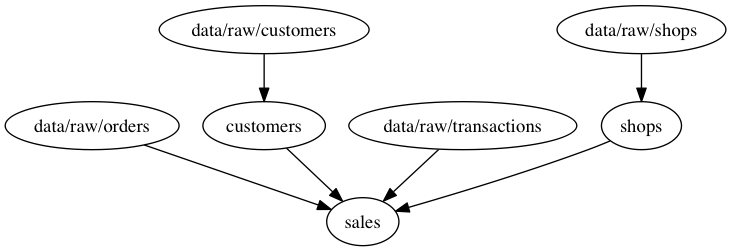
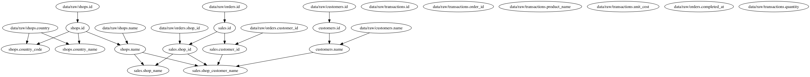

# Sample Data

```python
SCHEMAS = {
    'data/raw/orders': {
        'id': AttributeType.INT,
        'shop_id': AttributeType.INT,
        'customer_id': AttributeType.INT,
        'completed_at': AttributeType.TIMESTAMP,
    },
    'data/raw/transactions': {
        'id': AttributeType.INT,
        'order_id': AttributeType.INT,
        'product_name': AttributeType.STRING,
        'unit_cost': AttributeType.DECIMAL,
        'quantity': AttributeType.INT,
    },
    'data/raw/customers': {
        'id': AttributeType.INT,
        'name': AttributeType.STRING,
    },
    'data/raw/shops': {
        'id': AttributeType.INT,
        'name': AttributeType.STRING,
        'country': AttributeType.STRING,
    }
}

raw_orders = Source('data/raw/orders')
raw_transactions = Source('data/raw/transactions')
raw_customers = Source('data/raw/customers')
raw_shops = Source('data/raw/shops')


class Shops(Derived):
    RELATIONSHIPS = {
        'shops': Join(raw_shops, 'id')
    }

    @input('id', 'shops.id')
    @output(AttributeType.INT)
    def id(id):
        return id

    @input('name', 'shops.name')
    @output(AttributeType.STRING)
    def name(name):
        return name

    @input('country', 'shops.country')
    @output(AttributeType.STRING)
    def country_name(country):
        return country.lower()

    @input('country', 'shops.country')
    @output(AttributeType.STRING)
    def country_code(country):
        codes = {'united states': 'US',
                 'canada': 'CA'}
        return codes.get(country.lower())


class Customers(Derived):
    RELATIONSHIPS = {
        'customers': Join(raw_customers, 'id')
    }

    @input('id', 'customers.id')
    @output(AttributeType.INT)
    def id(id):
        return id

    @input('name', 'customers.name')
    @output(AttributeType.STRING)
    def name(name):
        return name


class Sales(Derived):
    RELATIONSHIPS = {
        'orders': Join(raw_orders, 'id'),
        'transactions': Join(raw_transactions, 'order_id'),
        'shops': Join(Shops(), 'id', match_name='shop_id'),
        'customers': Join(Customers(), 'id', match_name='customer_id')
    }

    @input('id', 'orders.id')
    @output(AttributeType.INT)
    def id(id):
        return id

    @input('id', 'orders.shop_id')
    @output(AttributeType.INT)
    def shop_id(id):
        return id

    @input('id', 'orders.customer_id')
    @output(AttributeType.INT)
    def customer_id(id):
        return id

    @input('name', 'shops.name')
    @output(AttributeType.STRING)
    def shop_name(name):
        return name

    @input('shop_name', 'shops.name')
    @input('customer_name', 'customers.name')
    @output(AttributeType.STRING)
    def shop_customer_name(shop_name, customer_name):
        return '{}:{}'.format(shop_name, customer_name)
```

# Entity Graph

```python
shops = Shops()
customers = Customers()
sales = Sales()

entity_graph = build_entity_graph((raw_orders, raw_transactions, raw_customers, raw_shops, shops, customers, sales))
entity_graph.render()
```



# Attribute Graph

```python
attr_graph = build_attribute_graph(entity_graph)
attr_graph.render()
```



# Execution Order

```python
print(execution_order(attr_graph))
```

```
[{'data/raw/customers.id',
  'data/raw/customers.name',
  'data/raw/orders.completed_at',
  'data/raw/orders.customer_id',
  'data/raw/orders.id',
  'data/raw/orders.shop_id',
  'data/raw/shops.country',
  'data/raw/shops.id',
  'data/raw/shops.name',
  'data/raw/transactions.id',
  'data/raw/transactions.order_id',
  'data/raw/transactions.product_name',
  'data/raw/transactions.quantity',
  'data/raw/transactions.unit_cost'},
 {'customers.id', 'sales.id', 'shops.id'},
 {'customers.name',
  'sales.customer_id',
  'sales.shop_id',
  'shops.country_code',
  'shops.country_name',
  'shops.name'},
 {'sales.shop_customer_name', 'sales.shop_name'}]
```
